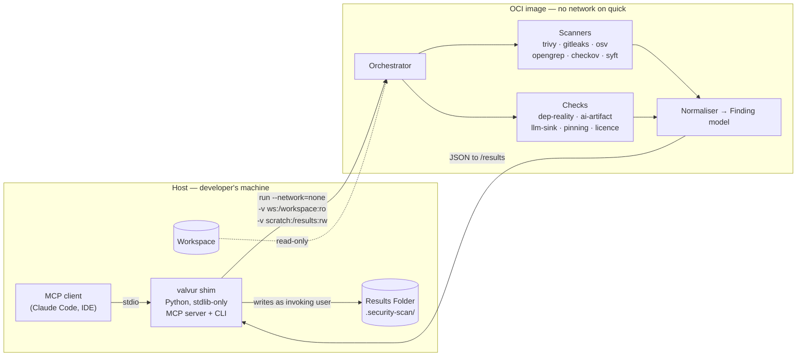

# valvur — Design

**Status:** approved for implementation · **Version:** 1.0 · **Date:** 2026-08-30

Implements [requirements.md](./requirements.md). Decisions marked ADR-NNNN are
recorded in [docs/adr/](../../../docs/adr/); this document does not re-argue them.

---

## 1. Architecture

Two artifacts, versioned together (ADR-0001).



**Why the shim writes, not the container:** container-written files land with broken
ownership differently on every runtime — root-owned under rootful Docker,
subuid-mapped under rootless Podman, unreadable without `:z` under SELinux. Confining
the only read-write mount to a host-owned scratch directory removes the entire
compatibility matrix (F1.4).

### 1.1 Host shim

Pure Python, standard library only, no **Scanner** dependencies (F10.6). Responsible
for: runtime detection and flag construction (F1.5, F1.6), host↔container path
translation, invoking the image, reading normalised results from scratch, writing the
**Results Folder** (F1.3), the gitignore guarantee (F7.2, F7.3), **Suppression**
loading (F8.1), **Status** diffing against `state.json` (F5.6), and the MCP/CLI
surface (F9).

Version compatibility is checked on every invocation; a major mismatch refuses to run
(F1.9).

### 1.2 Container image

Multi-stage. Go binaries (trivy, gitleaks, osv-scanner, syft) copied from pinned
upstream release stages; Python layer for opengrep, checkov and the **Checks**.
Non-root user, read-only root filesystem, all capabilities dropped (F10.2).

---

## 2. Profiles

| | `quick` | `standard` (default) | `deep` |
|---|---|---|---|
| Budget (N1) | <60s | <5min | unbounded |
| Network | **none** | registry + EPSS | + image registries |
| Opengrep | fast ruleset | full | full |
| Gitleaks | working tree | + git history | + git history |
| Trivy | fs | fs + config | + image scan |
| OSV-Scanner | — | ✓ | ✓ |
| Checkov | — | ✓ | ✓ |
| Syft | — | ✓ | ✓ |
| Licence hygiene | ✓ (F4.1–4.3) | ✓ (all) | ✓ + copyright |
| Dependency Reality | offline heuristics | ✓ | ✓ |
| AI Artifact | ✓ | ✓ | ✓ |
| LLM-sink, Pinning | — | ✓ | ✓ |
| Enrichment | bundled KEV | KEV + EPSS | KEV + EPSS |

`quick` is the offline guarantee (F1.2, N2.1). The AI Artifact **Check** runs in every
**Profile** because it is pure static inspection and cheap.

---

## 3. Finding model

```jsonc
{
  "schema": 1,
  "fingerprint": "…",           // F5.3
  "fp_version": 1,              // F5.5
  "class": "dependency_vuln",   // F5.2
  "status": "new",              // F5.6
  "severity": "high",           // as reported by the source
  "rank": 1,                    // computed, F6.5
  "title": "…",
  "location": {"path": "…", "line": 42, "resource": null},
  "sources": [                  // F5.8 — plural: dedup keeps every reporter
    {"tool": "trivy", "version": "0.58.1", "rule": "CVE-2021-44228"}
  ],
  "exploit": {                  // F6.1
    "cve": "CVE-2021-44228", "kev": true, "ransomware": true,
    "epss": 0.99999, "epss_date": "2026-08-29"
  },
  "dependency": {               // F6.9
    "ecosystem": "npm", "package": "lodash", "version": "4.17.11",
    "scope": "production", "direct": false,
    "path": ["your-app", "webpack@4.46.0", "lodash@4.17.11"],
    "fix": {"package": "webpack", "version": ">=5.0.0"}
  },
  "suppressed": null            // F8.6
}
```

### 3.1 Fingerprint derivation (ADR-0003, F5.3)

Paths are **Workspace**-relative so fingerprints are portable (F5.4). Every input is
lowercased and NFC-normalised before hashing.

| Finding Class | Key |
|---|---|
| `dependency_vuln` | `(ecosystem, package, version, vuln_id)` |
| `secret` | `(rule, path, sha256(secret)[:16])` |
| `iac_misconfig` | `(rule, path, resource_address)` |
| `licence` | `(package \| "<project>", license_id)` |
| `dependency_reality` | `(ecosystem, package)` |
| `sast` / `ai_artifact` | `(rule, path, sha256(normalised_match), ordinal)` |

`normalised_match` collapses internal whitespace and hashes **only the matched text**
— never surrounding context, since nearby edits must not break identity. `ordinal`
disambiguates repeats of the same hash within one file.

### 3.2 Ranking (F6.5)

Sort key, descending: KEV-with-ransomware → KEV → EPSS percentile → severity →
class weight. Development-scope dependencies are demoted one full tier (F6.6). The
intended inversion: a CVSS 6.5 in KEV outranks a CVSS 9.8 at 0.04% EPSS.

### 3.3 Deduplication (F5.8)

Trivy and OSV-Scanner overlap heavily. Two **Findings** merge when their fingerprints
match; `sources` accumulates. Disagreement between them is retained and surfaced,
because it is signal about data quality rather than noise.

---

## 4. Enrichment (ADR-0007)

```
EnrichmentProvider (interface)
└── LocalProvider          the only v1 implementation
    ├── KEV     bundled snapshot in the image (F6.2), ~1600 entries
    └── EPSS    FIRST batch API, only for CVEs present in the run (F6.3)
```

Staleness threshold: **30 days**. Beyond it, `SUMMARY.md` carries a warning (F6.7). A
confident answer from a stale snapshot is worse than an absent one.

Offline degradation is explicit, never silent (F6.4). KEV alone is the higher-signal
half, so `quick` loses less than it appears.

---

## 5. Checks

### 5.1 Dependency Reality (F3.1–F3.5)
Parse manifests → query registry metadata per package. Thresholds:

| Signal | Rule | Class |
|---|---|---|
| Not on registry | absent | **critical** — hallucinated (F3.2) |
| New and unadopted | published <90d AND downloads <1000/mo | **high** — possible slopsquat (F3.3) |
| Near-miss | edit distance ≤1 from a package with ≥100× downloads | **high** — typosquat (F3.4) |

Offline (`quick`), only edit-distance and pinning heuristics run; the network portion
is recorded as skipped and its packages are **not** reported clean (F3.5).

### 5.2 AI Artifact (F3.6–F3.9)
Static inspection of agent instruction and configuration files: hidden Unicode
(zero-width, bidi, tag), imperative directives addressed to an assistant, MCP servers
on mutable refs, blanket `autoApprove`, permission-bypass flags. All **Workspace**
content is data (F3.12) — matched text is quoted into **Findings**, never interpreted.

### 5.3 LLM-Output-to-Sink (F3.10) · Pinning Hygiene (F3.11)
Custom Opengrep rulesets, versioned with the image.

### 5.4 Licence (F4)
Project hygiene by SPDX text matching against the licence file, cross-checked with
package metadata. Dependency licences from Syft/Trivy. Default policy: copyleft
(GPL/AGPL/SSPL) inside a permissive-declared project is a **Finding**; unknown
licence is a **Finding**. Policy is overridable in `.security-scan.toml`.

---

## 6. Results generation

All artifacts are projections of one in-memory list, generated in a single pass
(ADR-0002). F7.13 is enforced by a test, not by convention.

**Redaction (F5.7)** happens at the boundary of the **Finding** model — a secret value
never enters it, so it cannot leak into any projection including `raw/`. This is a
structural placement, not a filter applied per writer.

`SUMMARY.md` budget (F7.5, 200 lines): machine-facing header ~25 · failures and skips
~15 · counts by class and status ~20 · top 15 **Findings** ~100 · pointers ~10. When
**Findings** exceed the budget, the count is stated and the list truncates — the
budget is never exceeded.

---

## 7. Error handling

| Condition | Behaviour | Req |
|---|---|---|
| Scanner non-zero with findings | Success | F2.4 |
| Scanner crash / timeout / bad output | Record, surface at top of SUMMARY, continue | F2.5, F2.7 |
| All scanners fail | **Scan Run** fails, exit non-zero | N3.2 |
| Registry unreachable | Check skipped, recorded, not reported clean | F3.5 |
| EPSS unreachable | Degrade to KEV, record | F6.4 |
| No container runtime | Refuse with remediation text | F1.5 |
| Shim/image version mismatch | Refuse, state both versions | F1.9 |
| Suppression without expiry | Reject it, raise a **Finding** | F8.3 |

Governing rule: **findings never fail the run; infrastructure failures always
surface** (N3.2). Silent failure manufactures false confidence and is worse than no
scan.

---

## 8. MCP tool contracts (F9)

| Tool | Args | Returns |
|---|---|---|
| `scan` | `path`, `profile?` | Run summary, counts by status, folder location |
| `list_findings` | `path`, `status?`, `class?`, `limit?` | Ranked **Findings**, no evidence bodies |
| `explain_finding` | `path`, `fingerprint` | Evidence, **Exploit Signals**, **Dependency Path**, source (F9.8) |
| `scan_status` | `path` | Last-run **Provenance** |

No tool mutates the **Workspace** (F9.2). No tool triggers a scan implicitly (F9.4).

---

## 9. Testing strategy

Test-first. Contracts before implementation.

| Layer | Covers | Notes |
|---|---|---|
| **Unit** | Fingerprint derivation per class, normalisation, redaction, ranking, suppression expiry, SUMMARY budget | Highest value — write these first |
| **Golden** | Normalisation of captured real `raw/` output per Scanner | Fixtures pinned with the Scanner version; upgrading a Scanner must diff here |
| **Integration** | Orchestrator against a fixture Workspace with known planted findings | Includes a deliberately vulnerable fixture repo |
| **E2E** | Full shim → container → Results Folder, on Docker **and** Podman | Asserts F1.4 file ownership on both |
| **Constraint** | `quick` **Profile** with networking disabled, failing on any socket attempt | **N2.1 — the moat as a regression test** |
| **Self-scan** | valvur's `standard` **Profile** against valvur | Release gate (N2.5) |

The constraint test is the most important in the suite: it converts the central
product claim from an assertion into something CI proves on every commit.

**Fixture repository** — a deliberately broken **Workspace** carrying at least one
planted instance of each **Finding Class**: a known CVE, a fake secret, a
misconfigured Terraform resource, a nonexistent dependency, an agent file with
zero-width Unicode, an unpinned range, and a missing licence.

---

## 10. Deferred to v1.1

Git rename detection for fingerprint continuity · full ScanCode copyright analysis ·
TruffleHog verified secrets · GitHub Pages intel site · additional
`EnrichmentProvider` implementations.
