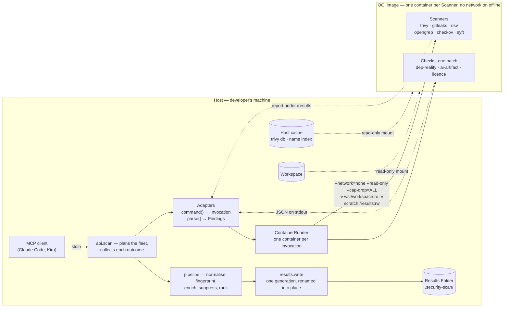

# valvur — Design

**Status:** approved for implementation · **Version:** 1.2 · **Date:** 2026-08-30, revised 2026-09-22 (tasks 26.2.1–26.5.2, 27.1.2, 27.2.2)

Implements [requirements.md](./requirements.md). Decisions marked ADR-NNNN are
recorded in [docs/adr/](../../../docs/adr/); this document does not re-argue them.

---

## 1. Architecture

Two artifacts, versioned together (ADR-0001).



**The orchestrator is host-side, and so is everything that reads a report.** The
image holds the Scanners, the Checks and nothing that decides: `api.scan` plans the
fleet and collects it, each adapter owns its tool's command line and its parser
(26.2.1), `ContainerRunner` owns the container, `pipeline.py`'s stages normalise and
rank, and `results.write` publishes one generation (26.0.3). This diagram drew the
orchestrator and the normaliser *inside* the image until task 27.2.2 — which was
never true of the shipped code and is the opposite of ADR-0001's reason for
existing: the shim writes, because a container-written file lands with broken
ownership on every runtime.

**Why the shim writes, not the container:** container-written files land with broken
ownership differently on every runtime — root-owned under rootful Docker,
subuid-mapped under rootless Podman, unreadable without `:z` under SELinux. Confining
the only read-write mount to a host-owned scratch directory removes the entire
compatibility matrix (F1.4).

### 1.1 Host shim

Pure Python, standard library only, no **Scanner** dependencies (F10.6). Responsible
for: runtime detection and flag construction (F1.5, F1.6), host↔container path
translation, invoking the image, reading normalised results from scratch, writing the
**Results Folder** (F1.3), the gitignore guarantee (F7.2, F7.3), **Suppression**
loading (F8.1), **Status** diffing against `state.json` (F5.6), and the MCP/CLI
surface (F9).

Compatibility is checked on every invocation, by protocol major (F1.9; §1.3): a
different major refuses to run, a different version with the same major runs and
is reported.

Since task 26.2.1 the shim is two halves with one contract between them: each
**Scanner**'s adapter owns its command — `ScannerAdapter.command(workspace)` returns
an `Invocation` (argv after the image, the report file under `/results`, timeout,
the network and exec grants) — and `ContainerRunner.run(invocation, workspace)`
owns the container: runtime, mounts, user, read-only root, SELinux labels, the
kill registry. `runner.py` names no tool; a snapshot per Scanner under
`tests/fixtures/invocations/` holds every argv to what it was before the split.

### 1.2 Container image

Multi-stage. Go binaries (trivy, gitleaks, osv-scanner, syft) copied from pinned
upstream release stages; Python layer for opengrep, checkov and the **Checks**.
Non-root user, read-only root filesystem, all capabilities dropped (F10.2).

### 1.3 The shim/image protocol (F1.9, task 26.3.1)

Everything the shim assumes of the image is one document, `docs/PROTOCOL.md`, and
one label the image carries, `org.valvur.protocol`, whose value is a **major
version and only a major** — `compat.PROTOCOL` on the shim's side, with a test
holding the Dockerfile to the same number:

| the image says | the shim does |
|---|---|
| the same major | runs; a different version is reported (`build.match`, 23.4.4), never refused |
| a different major | refuses, naming both protocols and both versions and the fix — the one thing refused |
| no label | an image from before protocol 1 (`0.3.0` and earlier): the version-series rule as before |

The document lists every path (four are mounts the shim provides — `/workspace`
read-only, `/results`, `/cache/trivy`, `/cache/names` — plus the `/tmp` tmpfs; the
rest are the image's), every binary and its pin, the Checks' entry point
(`python -m valvur.checks <name>` and `batch`) with both JSON shapes, the labels,
and the process (user 10001, `--read-only`, `--cap-drop=ALL`, `--network=none`
unless granted, no `ENTRYPOINT`). It is held to the code in both directions: a
unit test asserts every absolute path any `Invocation` names is a row; an e2e
test asserts every row the image is said to provide exists in the built image, on
both architectures. A change that breaks anything on the page bumps the major; an
addition does not. `check` and `doctor` share one verdict.

---

## 2. Profiles (F2.3, ADR-0016)

Two, split on the only line that matters to this product: whether anything leaves
the machine. The earlier `quick`/`standard`/`deep` split was drawn along speed while
being described as a network boundary; the old names still resolve (`quick` →
`offline`, `standard` and `deep` → `full`).

| | `offline` (the default) | `full` |
|---|---|---|
| Budget | N1.1: under 60s | N1.2: under 5 minutes; 300s over MCP unless the client says otherwise |
| Network | **none**: every container `--network=none`, the host shim opens no socket | the registries and OSV below, EPSS from FIRST |
| Gitleaks, Opengrep, Trivy, Checkov, Syft | ✓ | ✓ |
| OSV-Scanner | — (needs api.osv.dev) | ✓, a second advisory source |
| Licence, AI Artifact | ✓ | ✓ |
| Dependency Reality | existence and near-misses, from the Name Index (ADR-0018) | + first-publish age from the five registries, npm adoption from api.npmjs.org, JVM and Go existence from Maven Central and the Go proxy |
| Enrichment | bundled KEV | KEV + EPSS |

`profiles.select` is the only place a network is granted to an adapter; `offline`
is the offline guarantee (F1.2, N2.1). What each Profile does *not* look at is stated
in `SUMMARY.md` and `run.json` (`profiles.gaps_in_prose`), never left to be inferred.

## 2a. Egress — one authority (N2.1, ADR-0010, task 26.2.2)

The decision above is written once, in `egress.py`, and everything that acts on it
calls in:

- `egress.for_profile(profile).network` — the boolean, read from
  `profiles.ALLOWS_NETWORK`, which stays the Profile table.
- `Egress.container_flags()` — `["--network=none"]`, or with a network: `--env
  VALVUR_NETWORK=1` (the Check that asks a registry does so only when it sees this,
  ADR-0018), the database mirror for Trivy if one is named, and the user-defined
  network to join if there is one (`VALVUR_CONTAINER_NETWORK`, F10.5). The runner's
  flag builder and both image probes (`compat`, `doctor`) use it; `egress.NONE` is
  the probe's no-interface launch.
- `Egress.hosts()` — nothing, or `FULL_HOSTS`: every host `full` may reach, derived
  from `SPOKEN_AS`, which pairs each host with how the disclosure sentence names it.
  `doctor --network` probes this list.
- `egress.disclosure(used=)` — `run.json`'s `what_left_the_machine`: the one word
  `nothing`, or the one sentence that names every destination and what is sent to
  it. This sentence **is** the non-exfiltration claim (§3 of CLAUDE.md); 23.5.4 found
  it had lagged the truth by three registries for a week, so a test now holds every
  host to a spoken name and every spoken name to the sentence.

A test refuses the `"--network=` literal anywhere under `src/valvur` but
`egress.py`. `scripts/verify-offline.py` keeps its own literal on purpose — it is the
reviewer's independent check and must not merely ask egress whether egress agrees
with itself — and asks egress as well.

---

## 3. Finding model

```jsonc
{
  "schema": 1,
  "fingerprint": "…",           // F5.3
  "fp_version": 1,              // F5.5
  "class": "dependency_vuln",   // F5.2
  "status": "new",              // F5.6
  "severity": "high",           // as reported by the source
  "rank": 1,                    // computed, F6.5
  "title": "…",
  "location": {"path": "…", "line": 42, "resource": null},
  "sources": [                  // F5.8 — plural: dedup keeps every reporter
    {"tool": "trivy", "version": "0.58.1", "rule": "CVE-2021-44228"}
  ],
  "exploit": {                  // F6.1
    "cve": "CVE-2021-44228", "kev": true, "ransomware": true,
    "epss": 0.99999, "epss_date": "2026-08-29"
  },
  "dependency": {               // F6.9
    "ecosystem": "npm", "package": "lodash", "version": "4.17.11",
    "scope": "production", "direct": false,
    "path": ["your-app", "webpack@4.46.0", "lodash@4.17.11"],
    "fix": {"package": "webpack", "version": ">=5.0.0"}
  },
  "suppressed": null            // F8.6
}
```

### 3.1 Fingerprint derivation (ADR-0003, F5.3)

Paths are **Workspace**-relative so fingerprints are portable (F5.4). Every input is
lowercased and NFC-normalised before hashing.

| Finding Class | Key |
|---|---|
| `dependency_vuln` | `(ecosystem, package, version, vuln_id)` |
| `secret` | `(rule, path, sha256(secret)[:16])` |
| `iac_misconfig` | `(rule, path, resource_address)` |
| `licence` | `(package \| "<project>", license_id)` |
| `dependency_reality` | `(ecosystem, package)` |
| `sast` / `ai_artifact` | `(rule, path, sha256(normalised_match), ordinal)` |

`normalised_match` collapses internal whitespace and hashes **only the matched text**
— never surrounding context, since nearby edits must not break identity. `ordinal`
disambiguates repeats of the same hash within one file.

### 3.2 Ranking (F6.5)

Sort key, descending: KEV-with-ransomware → KEV → EPSS percentile → severity →
class weight. Development-scope dependencies are demoted one full tier (F6.6). The
intended inversion: a CVSS 6.5 in KEV outranks a CVSS 9.8 at 0.04% EPSS.

### 3.3 Deduplication (F5.8)

Trivy and OSV-Scanner overlap heavily. Two **Findings** merge when their fingerprints
match; `sources` accumulates. Disagreement between them is retained and surfaced,
because it is signal about data quality rather than noise.

---

## 4. Enrichment (ADR-0007)

```
EnrichmentProvider (interface)
└── LocalProvider          the only v1 implementation
    ├── KEV     bundled snapshot in the image (F6.2), ~1600 entries
    └── EPSS    FIRST batch API, only for CVEs present in the run (F6.3)
```

Staleness threshold: **30 days**. Beyond it, `SUMMARY.md` carries a warning (F6.7). A
confident answer from a stale snapshot is worse than an absent one.

Offline degradation is explicit, never silent (F6.4). KEV alone is the higher-signal
half, so `offline` loses less than it appears.

---

## 5. Checks

### 5.1 Dependency Reality (F3.1–F3.5)

Read every declared dependency from the manifests on disk; answer *does this name
exist* from the **Name Index** in the host cache (ADR-0018), with no socket; ask a
registry only for what the index cannot answer, and only on `full`.

| ecosystem | manifests read | seen but not read | existence |
|---|---|---|---|
| Python | `requirements*.txt`, `pyproject.toml` | `Pipfile`, `setup.py`, `setup.cfg`, `poetry.lock`, `uv.lock` | index, offline |
| npm | `package.json` | `package-lock.json`, `pnpm-lock.yaml`, `yarn.lock` | index, offline |
| Ruby (Bundler) | `Gemfile`, `*.gemspec` | `Gemfile.lock` | index, offline |
| PHP (Composer) | `composer.json` | `composer.lock` | index, offline |
| Rust (Cargo) | `Cargo.toml` | `Cargo.lock` | index, offline |
| JVM (Maven/Gradle) | `pom.xml`, `build.gradle[.kts]`, `gradle/libs.versions.toml` | `settings.gradle[.kts]`, `gradle.lockfile` | Maven Central, **`full` only** |
| Go | `go.mod` | `go.sum` | the Go proxy, **`full` only** |

Maven and the Go proxy publish no name list an offline index could be built from
(22.A.4), so on `offline` those two are a **stated Profile omission** rather than
silence. A manifest in the *seen* column with nothing readable beside it is a
**coverage note**, so a gap is reported rather than inferred from a clean result.

| Signal | Rule | Class |
|---|---|---|
| Not on the registry | absent from the index (or, on `full`, from Maven Central or the Go proxy) | **high** — hallucinated (F3.2) |
| Near-miss | edit distance ≤1 from a popular Python package (`_near_miss`, pip only) | **medium** — typosquat (F3.4) |
| Newly registered | first published <90 days ago (`NEW_PACKAGE_DAYS`) — `full` only | **medium**, and **high** for an npm name with <1,000 downloads last month (`NPM_UNADOPTED_DOWNLOADS`, 23.5.4) | 

All three are `valvur.dependency.*` rules; the identity is `(ecosystem,
package_name)` (§8 of `CLAUDE.md`). An index older than thirty days makes a nil
result `inconclusive` rather than `clean` (ADR-0018).

*This section read "`requirements*.txt` against PyPI, and nothing else" until task
27.2.2 — written before ADR-0018 and two Block-2 tasks made it false. The table
above is generated from nothing, so a test holds its ecosystems to
`ecosystems.MANIFESTS`.*

### 5.2 AI Artifact (F3.6–F3.9)
Static inspection of agent instruction and configuration files: hidden Unicode
(zero-width, bidi, tag), imperative directives addressed to an assistant, MCP servers
on mutable refs, blanket `autoApprove`, permission-bypass flags. All **Workspace**
content is data (F3.12) — matched text is quoted into **Findings**, never interpreted.

### 5.3 LLM-Output-to-Sink (F3.10) · Pinning Hygiene (F3.11)
Custom Opengrep rulesets, versioned with the image.

### 5.4 Licence (F4)
Project hygiene by SPDX text matching against the licence file, cross-checked with
package metadata. Dependency licences from Syft/Trivy. Default policy: copyleft
(GPL/AGPL/SSPL) inside a permissive-declared project is a **Finding**; unknown
licence is a **Finding**. Policy is overridable in `.security-scan.toml`.

---

## 6. Results generation

All artifacts are projections of one in-memory list, generated in a single pass
(ADR-0002). F7.13 is enforced by a test, not by convention.

**Redaction (F5.7)** happens at the boundary of the **Finding** model — a secret value
never enters it, so it cannot leak into any projection including `raw/`. This is a
structural placement, not a filter applied per writer.

`SUMMARY.md` budget (F7.5, 200 lines): machine-facing header ~25 · failures and skips
~15 · counts by class and status ~20 · top 15 **Findings** ~100 · pointers ~10. When
**Findings** exceed the budget, the count is stated and the list truncates — the
budget is never exceeded.

---

## 6a. Data freshness and the third status (F6.11, F7.16–F7.17)

Presence of a **Finding** needs no fresh data to mean something. **Absence** does.
That asymmetry is the whole design.

**Age is read from the data, not the file.** Trivy stamps `UpdatedAt` when it builds
the database; the file's mtime records only when it was fetched. An air-gapped mirror
(F10.5) can serve a six-month-old database this morning, so mtime would report the
users who most need the warning as the freshest of all.

**Threshold: 7 days.** Derived, not chosen — Trivy sets `NextUpdate` to
`UpdatedAt + 24h`, so seven days is seven missed rebuilds. KEV's 30-day threshold
stays looser deliberately: it changes how **Findings** rank, not whether they exist.

**Three statuses.**

| | |
|---|---|
| `findings` | at least one **Finding**, whatever the database's age |
| `clean` | none, and the database was current enough for that to be evidence |
| `inconclusive` | none, and it was not |

The verdict carries the claim rather than a caveat in prose. Agents are instructed to
read `SUMMARY.md` bounded and query `findings.json` per **Finding** (F9.5–F9.7), so
the consumer most likely to act on a verdict is the least likely to read a warning
beside it. Every MCP tool restates the age and the consequence for the same reason.

**valvur never refreshes the database itself** (F10.8). It is a 116MB download; doing
it inside a scan the developer asked to be fast is hostile, and doing it only on
`full` would make the two **Profiles** scan different data. `valvur update --if-stale`
costs one file read when current, which is what makes it safe in a hook.

## 6b. Concurrency and interruption (F1.11, F1.12, F7.18, N2.6)

Two resources, two policies, one mechanism (`fcntl.flock`).

| resource | lock | contention |
|---|---|---|
| **Workspace** | `.security-scan/.lock` | exclusive, **fails fast** |
| Database cache | `~/.cache/valvur/.lock` | **shared** for scans, exclusive for `update`, which waits |

Concurrent scans corrupt nothing — measured — but each reads the same `state.json`
and the last to write wins, so the next run's **Status** diff is computed against a
view that never happened. Readers of the database share freely because only `update`
writes; making scans exclude each other there would serialise unrelated work.

`flock` rather than a PID file: the kernel releases it when the process dies, so a
crashed or interrupted run leaves nothing to reap. Locks are taken in a fixed order —
**Workspace**, then cache — so two scans cannot deadlock.

**Interruption is a third outcome** (F1.11), not a failure. `docker run` propagates no
useful signal and the daemon owns the container lifecycle, so every container is
named and killed explicitly. No **Results Folder** is written, because "a Scanner
produced no report" is already a failure path (§7) and a cancelled scan must not be
mistaken for one.

Taking the **Workspace** lock creates the **Results Folder** before a scan has
produced anything, so it writes its own `.gitignore` at that moment (F7.18) —
ADR-0011 is a guarantee about the folder, not about a successful run.

## 6c. Distribution (F10.7)

The image is published for `linux/amd64` and `linux/arm64` as one index, and the
signature covers the index rather than a child manifest — signing one architecture
would leave the other unsigned, which is the same defect as signing a mutable tag.

CI tests the **published** artifact, not a local build. Both workflows built locally
and neither pulled what was published, which is why `0.1.0rc1` shipped `arm64`-only
and no test could see it. Since 26.1.2 it tests it on **both** architectures: the
release's `artifact` job and CI's published-image job are each a two-runner matrix,
and the pipeline verifies the signature, the SLSA provenance and each
distribution's attestation read back from the index (26.1.3, F10.3).

## 6d. The release: stage, validate, promote (N2.5, ADR-0020)

`release.yml` runs `verify → build ×2 → stage → artifact → promote`. `stage` pushes
the index under a **candidate** tag, signs and attests the digest, builds `dist/`;
`artifact` validates the wheel and that digest together; only `promote`, after it,
re-tags the same digest as the version and `latest`, publishes to PyPI and creates
the GitHub release. A failed validation leaves a candidate tag and nothing a user
can install; the version number is not burned. The `release` environment — and any
required reviewer on it — sits on `promote`, after the evidence and before the
irreversible step. Rehearsed by `workflow_dispatch` against throwaway targets
before every real tag.


## 7. Error handling

| Condition | Behaviour | Req |
|---|---|---|
| Scanner non-zero with findings | Success | F2.4 |
| Scanner crash / timeout / bad output | Record, surface at top of SUMMARY, continue | F2.5, F2.7 |
| All scanners fail | **Scan Run** fails, exit non-zero | N3.2 |
| Registry unreachable | Check skipped, recorded, not reported clean | F3.5 |
| EPSS unreachable | Degrade to KEV, record | F6.4 |
| No container runtime | Refuse with remediation text | F1.5 |
| Shim/image version mismatch | Refuse, state both versions | F1.9 |
| Suppression without expiry | Reject it, raise a **Finding** | F8.3 |

Governing rule: **findings never fail the run; infrastructure failures always
surface** (N3.2). Silent failure manufactures false confidence and is worse than no
scan.

---

## 8. MCP tool contracts (F9)

Six, and `readOnlyHint` is what each says about itself on the wire (27.1.2): the
four readers declare `true`, and `scan` and `scan_cancel` declare `false` because
they act on the machine — a results folder, an image pull, containers started and
stopped. The annotation is narrower than F9.2 and does not weaken it.

| Tool | Args | Returns | `readOnlyHint` |
|---|---|---|---|
| `scan` | `workspace`, `profile?`, `budget_s?` | Run summary, counts by status, folder location | `false` |
| `scan_status` | `workspace` | Last-run **Provenance**, or a running scan's progress | `true` |
| `scan_cancel` | `workspace` | What was stopped; nothing is written (F1.11) | `false` |
| `list_findings` | `workspace`, `status?`, `class?`, `limit?` | Ranked **Findings**, no evidence bodies | `true` |
| `explain_finding` | `workspace`, `fingerprint` | Evidence, **Exploit Signals**, **Dependency Path**, source (F9.8) | `true` |
| `doctor` | `workspace?` | Every precondition a scan needs, with the fix for each (23.3.1) | `true` |

No tool mutates the **Workspace** (F9.2). No tool triggers a scan implicitly (F9.4).
No tool is destructive, and a test over the registry asserts it. `tools/list` is a
committed snapshot (23.5.2), so any change to this table is a diff in review.

**The handshake carries the rules, and the two readers answer in two forms
(28.2.2).** `initialize` returns `instructions`: the five rules `SUMMARY.md`'s
machine block opens with, from the same constant, so an agent that never opens the
folder has them before its first call. `scan_status` and `list_findings` declare
an `outputSchema` and answer `structuredContent` beside their text (MCP
2025-06-18) — the verdict, the counts, the Scanners and the next moves as fields;
the shown Findings as objects — computed in the same pass as the text, so the two
cannot disagree, with F9.9's neutralisation on both. `initialize` is a committed
snapshot too (`tests/fixtures/mcp/initialize.json`), version normalised.

---

## 9. Testing strategy

Test-first. Contracts before implementation.

| Layer | Covers | Notes |
|---|---|---|
| **Unit** | Fingerprint derivation per class, normalisation, redaction, ranking, suppression expiry, SUMMARY budget | Highest value — write these first |
| **Golden** | Normalisation of captured real `raw/` output per Scanner | Fixtures pinned with the Scanner version; upgrading a Scanner must diff here |
| **Integration** | Orchestrator against a fixture Workspace with known planted findings | Includes a deliberately vulnerable fixture repo |
| **E2E** | Full shim → container → Results Folder, on Docker **and** Podman | Asserts F1.4 file ownership on both |
| **Constraint** | `offline` **Profile** with networking disabled, failing on any socket attempt | **N2.1 — the moat as a regression test** |
| **Self-scan** | valvur's `full` **Profile** against valvur | Release gate (N2.5) |

The constraint test is the most important in the suite: it converts the central
product claim from an assertion into something CI proves on every commit.

**Fixture repository** — a deliberately broken **Workspace** carrying at least one
planted instance of each **Finding Class**: a known CVE, a fake secret, a
misconfigured Terraform resource, a nonexistent dependency, an agent file with
zero-width Unicode, an unpinned range, and a missing licence.

---

## 10. Deferred to v1.1

Git rename detection for fingerprint continuity · full ScanCode copyright analysis ·
TruffleHog verified secrets · GitHub Pages intel site · additional
`EnrichmentProvider` implementations.
