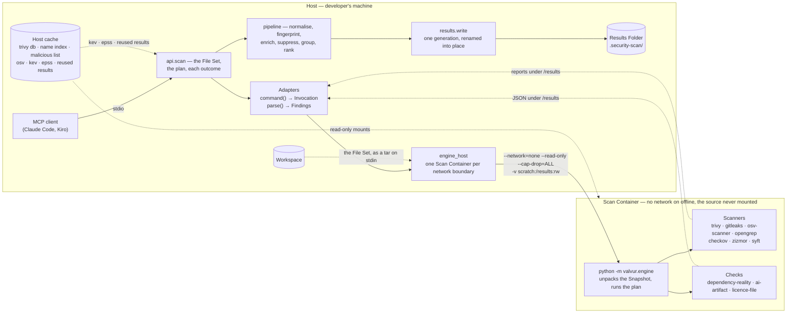

# valvur — Design

**Status:** approved for implementation · **Version:** 1.5 · **Date:** 2026-08-30, revised 2026-09-22 (tasks 26.2.1–26.5.2, 27.1.2, 27.2.2), 2026-09-28 as built through R6 (R7.2), 2026-09-29 with the modules R9 to R16 add (R9.2, §11), and 2026-09-30 as built through R16 (R16.4)

Implements [requirements.md](./requirements.md). Decisions marked ADR-NNNN are
recorded in [docs/adr/](../../../docs/adr/); this document does not re-argue them.

---

## 1. Architecture

Two artifacts, versioned together (ADR-0001).


```mermaid
flowchart LR
  subgraph host["Host — developer's machine"]
    agent["MCP client<br/>(Claude Code, Kiro)"]
    api["api.scan — the File Set,<br/>the plan, each outcome"]
    adapters["Adapters<br/>command() → Invocation<br/>parse() → Findings"]
    eh["engine_host<br/>one Scan Container per network boundary"]
    pipe["pipeline — normalise, fingerprint,<br/>enrich, suppress, group, rank"]
    results["results.write<br/>one generation, renamed into place"]
    ws[("Workspace")]
    rf[("Results Folder<br/>.security-scan/")]
    cache[("Host cache<br/>trivy db · name index · malicious list<br/>osv · kev · epss · reused results")]
  end
  subgraph img["Scan Container — no network on offline, the source never mounted"]
    eng["python -m valvur.engine<br/>unpacks the Snapshot, runs the plan"]
    sc["Scanners<br/>trivy · gitleaks · osv-scanner · opengrep<br/>checkov · zizmor · syft"]
    ck["Checks<br/>dependency-reality · ai-artifact · licence-file"]
  end
  agent -->|stdio| api
  api --> adapters --> eh
  ws -.->|"the File Set, as a tar on stdin"| eh
  eh -->|"--network=none --read-only --cap-drop=ALL<br/>-v scratch:/results:rw"| eng
  eng --> sc
  eng --> ck
  sc -.->|reports under /results| adapters
  ck -.->|JSON under /results| adapters
  api --> pipe --> results --> rf
  cache -.->|read-only mounts| img
  cache -.->|"kev · epss · reused results"| api
```

**The orchestrator is host-side, and so is everything that reads a report.** The
image holds the Scanners, the Checks and an engine that runs a plan and decides
nothing: `api.scan` decides the File Set once (ADR-0021), asks each adapter for its
command (26.2.1), and hands `engine_host` a plan; one Scan Container per network
boundary receives a Snapshot of the File Set on its standard input, runs every tool
in the plan and writes a manifest (ADR-0022, protocol 2); `pipeline.py`'s stages
normalise, group and rank, and `results.write` publishes one generation (26.0.3). The
shim writes, as ADR-0001 requires, because a container-written file lands with broken
ownership on every runtime.

**Why the shim writes, not the container:** container-written files land with broken
ownership differently on every runtime — root-owned under rootful Docker,
subuid-mapped under rootless Podman, unreadable without `:z` under SELinux. Confining
the only read-write mount to a host-owned scratch directory removes the entire
compatibility matrix (F1.4). Since R3.9 the source is not mounted at all: a Scanner
cannot modify what it was never given (ADR-0022).

### 1.1 Host shim

Pure Python, standard library only, no **Scanner** dependencies (F10.6). Responsible
for: runtime detection and flag construction (F1.5, F1.6), host↔container path
translation, invoking the image, reading normalised results from scratch, writing the
**Results Folder** (F1.3), the gitignore guarantee (F7.2, F7.3), **Suppression**
loading (F8.1), **Status** diffing against `state.json` (F5.6), and the MCP/CLI
surface (F9). R11 to R15 added: KEV and EPSS read from files in the host cache (§4),
`check_package` (§5.1), the store of reused results (§1.4), and the skill `init
--write` writes (§6f).

Compatibility is checked on every invocation, by protocol major (F1.9; §1.3): a
different major refuses to run, a different version with the same major runs and
is reported.

Since task 26.2.1 the shim is two halves with one contract between them: each
**Scanner**'s adapter owns its command — `ScannerAdapter.command(workspace)` returns
an `Invocation` (argv, the report file under `/results`, timeout, the network
grant) — and since R3.9 `engine_host.ContainerRuntime` owns the Scan Container: the
Snapshot, the plan, the runtime, the mounts, the user, the read-only root, the
SELinux labels, the owner labels a cancel and a restart find it by (R3.6). It names
no tool; a snapshot per Scanner under `tests/fixtures/invocations/` holds every argv.
`runner.ContainerRunner` remains for `valvur update`'s database fetch.

### 1.2 Container image

Multi-stage. Go binaries (trivy, gitleaks, osv-scanner, syft) copied from pinned
upstream release stages; Opengrep's release binary by checksum; Checkov and zizmor
each in its own hash-locked virtual environment; the `valvur` package for the engine
and the **Checks**. Non-root user, read-only root filesystem, all capabilities
dropped (F10.2).

### 1.3 The shim/image protocol (F1.9, task 26.3.1)

Everything the shim assumes of the image is one document, `docs/PROTOCOL.md`, and
one label the image carries, `org.valvur.protocol`, whose value is a **major
version and only a major** — `compat.PROTOCOL` on the shim's side, with a test
holding the Dockerfile to the same number:

| the image says | the shim does |
|---|---|
| the same major | runs; a different version is reported (`build.match`, 23.4.4), never refused |
| a different major | refuses, naming both protocols and both versions and the fix — the one thing refused |
| no label | an image from before protocol 1 (`0.3.0` and earlier): the version-series rule as before |

The document lists every path (six the shim provides — `/workspace`, the unpacked
Snapshot in a tmpfs, `/results`, `/cache/trivy`, `/cache/names` (the index, and since
R11.5 the malicious list beside it), `/cache/osv` and the `/tmp` tmpfs; the rest are
the image's), the engine's plan and manifest, every
binary and its pin, the Checks' entry point (`python -m valvur.checks <name>`), the
labels, and the process (user 10001, `--read-only`, `--cap-drop=ALL`,
`--network=none` unless granted, a memory ceiling, the owner labels, no
`ENTRYPOINT`). It is held to the code in both directions: a
unit test asserts every absolute path any `Invocation` names is a row; an e2e
test asserts every row the image is said to provide exists in the built image, on
both architectures. A change that breaks anything on the page bumps the major; an
addition does not. `check` and `doctor` share one verdict.

### 1.4 Reuse what cannot have changed (N1.5, ADR-0030, R14)

Trivy and OSV-Scanner read a project's dependency files and their own data, and
nothing else of it, so their answer cannot change while those do not. `valvur.reuse`
keeps each one's raw output in the host cache, `reuse/<tool>/<key>.json`, under a key
of everything that answer depends on:

- the Scanner and its version, and the **Profile**;
- the path and sha256 of every dependency file in the **File Set**, chosen by a named
  list of each ecosystem's lockfiles and manifests, Java archives, SBOMs and the tools'
  own configuration, erring wide; a source file or a README is not in it;
- the data it answered from: the database's build time, or each OSV export's date.

Before the Scan Container starts, `api.scan` computes each reusable Scanner's key. A
stored result for it becomes that Scanner's outcome, parsed as if it had just run, and
the Scanner leaves the plan; the progress says `reused`, and its entry in `run.json`
carries `reused_from`, the generation that ran it. A result that ran clean is stored,
whole and renamed into place, under the shared cache lock (§6b); a cut, a timeout or
a failure never is. OSV-Scanner is reused on `offline` only: on `full` it answers from
api.osv.dev, which has no stamp to key on. A Scanner that reads source is never reused,
since a source file's change is what a rescan is for.

`--fresh` on the CLI and `fresh: true` on `scan` run every Scanner, and store what they
ran, so a doubted result is replaced rather than reused again. `update --prune` removes
results whose Scanner version or data has moved on, and those unused for 30 days;
`--clear` removes them with the rest of the cache. Nothing is written in the
**Workspace** but the **Results Folder**. Measured: a warm rescan of acceptance
repository 8 is 63% faster on the Mac and 69% on Linux, with the same findings, so
D32's fallback was not needed (`docs/acceptance/r14.md`).

---

## 2. Profiles (F2.3, ADR-0016)

Two, split on the only line that matters to this product: whether anything leaves
the machine. The earlier `quick`/`standard`/`deep` split was drawn along speed while
being described as a network boundary; the old names still resolve (`quick` →
`offline`, `standard` and `deep` → `full`).

| | `offline` (the default) | `full` |
|---|---|---|
| Budget | N1.1: under 60s | N1.2: under 5 minutes; 300s over MCP unless the client says otherwise |
| Network | **none**: the Scan Container has no interface; the host shim fetches public data a scan lacks or holds stale, and nothing else (ADR-0025, ADR-0027) | the registries and OSV below; the same fetches of public data |
| Gitleaks, Opengrep, Trivy | ✓ | ✓ |
| Syft | when asked for, `--sbom` or `[scan] sbom = true` (D9, the owner's decision of 2026-09-28) | the same |
| Checkov | ✓ where there is infrastructure other than GitHub workflows (R4.3) | the same |
| zizmor | ✓ where there are workflows or action definitions (R4.2) | the same |
| OSV-Scanner | ✓ from OSV's offline database per ecosystem, in the host cache (R4.6) | ✓ from api.osv.dev |
| Licence, AI Artifact | ✓ | ✓ |
| Dependency Reality | existence and near-misses, from the Name Index (ADR-0018); known-malicious names, from the list beside it (ADR-0027); private registries, from the File Set (ADR-0028) | + first-publish age from the five registries, npm adoption from api.npmjs.org, JVM and Go existence from Maven Central and the Go proxy |
| Enrichment | KEV, and EPSS from FIRST's daily file (ADR-0027) | the same |
| Reuse (§1.4) | Trivy and OSV-Scanner | Trivy only |

`profiles.select` is the only place a network is granted to an adapter; `offline`
is the offline guarantee (F1.2, N2.1). What each Profile does *not* look at is stated
in `SUMMARY.md` and `run.json` (`profiles.gaps_in_prose`), never left to be inferred.

## 2a. Egress — one authority (N2.1, ADR-0010, task 26.2.2)

The decision above is written once, in `egress.py`, and everything that acts on it
calls in:

- `egress.for_profile(profile).network` — the boolean, read from
  `profiles.ALLOWS_NETWORK`, which stays the Profile table.
- `Egress.container_flags()` — `["--network=none"]`, or with a network: `--env
  VALVUR_NETWORK=1` (the Check that asks a registry does so only when it sees this,
  ADR-0018), the database mirror for Trivy if one is named, and the user-defined
  network to join if there is one (the `container_network` setting, F10.5). The runner's
  flag builder and both image probes (`compat`, `doctor`) use it; `egress.NONE` is
  the probe's no-interface launch.
- `Egress.hosts()` — nothing, or `FULL_HOSTS`: every host `full` may reach, derived
  from `SPOKEN_AS`, which pairs each host with how the disclosure sentence names it.
  `doctor --network` probes this list. Since R11.4 FIRST's API is not among them, and
  the sentence names no CVE identifier: EPSS comes from a file.
- `EPSS_HOSTS` — the daily EPSS file's host and the one it redirects to, reached by the
  host shim on every Profile as a recorded fetch of public data, like the database's
  and the index's (ADR-0027). `verify-offline.py` names them among the fetches of
  public data it permits, and `verify-mirror.py` checks `epss_url` as a mirror.
- `egress.disclosure(used=)` — `run.json`'s `what_left_the_machine`: the one word
  `nothing`, or the one sentence that names every destination and what is sent to
  it. This sentence **is** the non-exfiltration claim (§3 of CLAUDE.md); 23.5.4 found
  it had lagged the truth by three registries for a week, so a test now holds every
  host to a spoken name and every spoken name to the sentence.

A test refuses the `"--network=` literal anywhere under `src/valvur` but
`egress.py`. `scripts/verify-offline.py` keeps its own literal on purpose — it is the
reviewer's independent check and must not merely ask egress whether egress agrees
with itself — and asks egress as well.

---

## 3. Finding model

```jsonc
{
  "schema": 1,
  "fingerprint": "…",           // F5.3
  "fp_version": 1,              // F5.5
  "class": "dependency_vuln",   // F5.2
  "status": "new",              // F5.6
  "severity": "high",           // as reported by the source
  "rank": 1,                    // computed, F6.5
  "title": "…",
  "location": {"path": "…", "line": 42, "resource": null},
  "sources": [                  // F5.8 — plural: dedup keeps every reporter
    {"tool": "trivy", "version": "0.58.1", "rule": "CVE-2021-44228"}
  ],                            // F5.10: a static-analysis Finding also carries "cwe"
  "exploit": {                  // F6.1
    "cve": "CVE-2021-44228", "kev": true, "ransomware": true,
    "epss": 0.99999, "epss_date": "2026-08-29"
  },
  "dependency": {               // F6.9
    "ecosystem": "npm", "package": "lodash", "version": "4.17.11",
    "scope": "production", "direct": false,
    "path": ["your-app", "webpack@4.46.0", "lodash@4.17.11"],
    "fix": {"package": "webpack", "version": ">=5.0.0"}
  },
  "suppressed": null,           // F8.6
  "commit": null,               // R3.7: the commit that added a secret read from history
  "group": null                 // R5.1: "generic-api-key in data/ (data files)", or null
}
```

A **group** is one rule firing two or more times under one top-level directory, data
files apart from code (R5.1, R5.2): one entry with a count and its locations.
`findings.json` lists each beside the Findings, derived from their `group` ids: `{id,
rule, directory, count, files, machine_written, rank, label}`. A **flood**, a group of 25
or more data files, is labelled possibly machine-written and ranks below every distinct
Finding. Grouping drops nothing and changes no Fingerprint.

**`cwe`** (F5.10, R13.4) is the rule's declared CWEs as `CWE-n`, from the metadata
Opengrep passes with each result; valvur's rules and GitLab's are both read. It is an
optional addition, written only when there is one, so the schema stays 1. SARIF puts it
on the rule, with the `external/cwe/cwe-n` tag code-scanning tools read. Neither ranking
nor grouping reads it, and a merge keeps it.

### 3.1 Fingerprint derivation (ADR-0003, F5.3)

Paths are **Workspace**-relative so fingerprints are portable (F5.4). Every input is
lowercased and NFC-normalised before hashing.

| Finding Class | Key |
|---|---|
| `dependency_vuln` | `(ecosystem, package, version, vuln_id)` |
| `secret` | `(rule, path, sha256(secret)[:16])` |
| `iac_misconfig` | `(rule, path, resource_address)` |
| `licence` | `(package \| "<project>", license_id)` |
| `dependency_reality` | `(ecosystem, package)` |
| `sast` / `ai_artifact` | `(rule, path, sha256(normalised_match), ordinal)` |

`normalised_match` collapses internal whitespace and hashes **only the matched text**
— never surrounding context, since nearby edits must not break identity. `ordinal`
disambiguates repeats of the same hash within one file.

### 3.2 Ranking (F6.5)

Sort key, descending: KEV-with-ransomware → KEV → EPSS percentile → severity →
class weight. Development-scope dependencies are demoted one full tier (F6.6). The
intended inversion: a CVSS 6.5 in KEV outranks a CVSS 9.8 at 0.04% EPSS. Since R11.4
EPSS is read on every Profile (§4), so `offline` ranks as `full` does. A
known-malicious package is critical and carries the lowest class weight, beside a
nonexistent one, since it runs at install (D26). The Score's ranking gate holds the
inversion (§9a).

### 3.3 Deduplication (F5.8)

Trivy and OSV-Scanner overlap heavily. Two **Findings** merge when their fingerprints
match; `sources` accumulates. Disagreement between them is retained and surfaced,
because it is signal about data quality rather than noise.

Two folds follow the merge, in `findings.merge`, where one flaw would otherwise be two
Findings under identities of different classes or rules (ADR-0003):

- **A malicious package** (F3.14, R11.5): OSV-Scanner's `MAL-` advisory for a package
  folds into the dependency-reality Check's `valvur.dependency.malicious` for the same
  package. One Finding, both Scanners named, both identifiers in its title.
- **A repeated flaw** (R13): a vendored rule's Finding on a line where one of valvur's
  own rules reports the same CWE folds into valvur's, at the worse of the two
  severities.

The Finding kept keeps its Fingerprint.

---

## 4. Enrichment (ADR-0007)

```
EnrichmentProvider (interface)
└── LocalProvider          the only implementation
    ├── KEV     the bundled snapshot (F6.2), ~1600 entries, or the host cache's
    │           copy when its catalog is newer
    └── EPSS    FIRST's daily file in the host cache, on every Profile (F6.13)
```

It runs on the host, reads files, and opens no socket on any Profile (ADR-0027). Until
R11.4 `full` sent the CVEs a scan found to FIRST's API and `offline` ranked without
EPSS; F6.3 is superseded by F6.13.

- **KEV.** Its age is its catalog's `dateReleased`, not the file's time (F6.12, R11.1).
  Between the cache and the bundle, the newer catalog wins, not the newer file.
  `run.json` records the catalog's date, age and source as `kev_catalog`, and `doctor`
  shows them.
- **EPSS.** `epss_scores-current.csv.gz`, 2.7 MB compressed when measured (R11.4),
  fetched by `valvur update` and by a scan past two days, mirrorable as `epss_url`
  (F10.5). Its age is the `score_date` on its first line. `run.json` records
  `epss_scored` and `epss_age_days`.

Staleness threshold for KEV: **30 days**. Beyond it, `SUMMARY.md` carries a warning
(F6.7). A confident answer from a stale snapshot is worse than an absent one. Since
R11.1 the bundled snapshot reads its true age, so the warning fires when it should.
How each dataset is refreshed is §6a.

Degradation is explicit, never silent (F6.4): with no EPSS file, ranking uses KEV
alone, and `run.json`'s `data` block and `SUMMARY.md`'s `Data:` line say EPSS is
absent. KEV alone is the higher-signal half.

---

## 5. Checks

### 5.1 Dependency Reality (F3.1–F3.5)

Read every declared dependency from the manifests on disk; answer *does this name
exist* from the **Name Index** in the host cache (ADR-0018), with no socket; ask a
registry only for what the index cannot answer, and only on `full`.

| ecosystem | manifests read | seen but not read | existence |
|---|---|---|---|
| Python | `requirements*.txt`, `pyproject.toml`, `Pipfile` (since R10.4) | `setup.py`, `setup.cfg`, `poetry.lock`, `uv.lock` | index, offline |
| npm | `package.json` | `package-lock.json`, `pnpm-lock.yaml`, `yarn.lock` | index, offline |
| Ruby (Bundler) | `Gemfile`, `*.gemspec` | `Gemfile.lock` | index, offline |
| PHP (Composer) | `composer.json` | `composer.lock` | index, offline |
| Rust (Cargo) | `Cargo.toml` | `Cargo.lock` | index, offline |
| JVM (Maven/Gradle) | `pom.xml`, `build.gradle[.kts]`, `gradle/libs.versions.toml` | `settings.gradle[.kts]`, `gradle.lockfile` | Maven Central, **`full` only** |
| Go | `go.mod` | `go.sum` | the Go proxy, **`full` only** |

Maven and the Go proxy publish no name list an offline index could be built from
(22.A.4), so on `offline` those two are a **stated Profile omission** rather than
silence. A manifest in the *seen* column with nothing readable beside it is a
**coverage note**, so a gap is reported rather than inferred from a clean result.
The Check reads a lockfile for one thing only since R11.5: each locked version,
checked against the malicious list (below).

| Signal | Rule | Class |
|---|---|---|
| Known-malicious | on the malicious list by name, or, for a version-scoped entry, at a locked version it names | **critical** — `malicious`, reported first and not also asked about existence (F3.14) |
| Not on the registry | absent from the index (or, on `full`, from Maven Central or the Go proxy), with no registry configuration | **high** — hallucinated (F3.2); the message names the index's build date |
| Dependency confusion | absent from the index where a merged private source is configured | **high** — `confusion` (F3.15) |
| Not public | absent from the index where a private registry replaces the public one or is searched before it | **low** — `not-public`, advising the name be reserved (F3.15) |
| Near-miss | edit distance ≤1 from a popular Python package (`_near_miss`, pip only) | **medium** — typosquat (F3.4) |
| Newly registered | first published <90 days ago (`NEW_PACKAGE_DAYS`) — `full` only | **medium**, and **high** for an npm name with <1,000 downloads last month (`NPM_UNADOPTED_DOWNLOADS`, 23.5.4) | 

All are `valvur.dependency.*` rules; the identity is `(ecosystem,
package_name)` (§8 of `CLAUDE.md`). An index older than thirty days makes a nil
result `inconclusive` rather than `clean` (ADR-0018); a scan refreshes it past two
(§6a).

**The malicious list** (F3.14, ADR-0027, R11.5). `index.yml` builds it daily from
ossf/malicious-packages (Apache-2.0, credited in `NOTICE`) for the ecosystems the index
covers, and publishes it as the tags `malicious` and `malicious-<date>` of the index's
own package, signed, pulled back and compared before it is tagged, as the index is.
One line per name: the name, its versions or `*`, and its `MAL-` identifiers. The
Check reads it by bisection from the index's mount, for declared packages and for
every locked one, direct or not, read once per walk by `ecosystems/locked.py`. `valvur
update` pulls it with the index, and a scan pulls it past two days but never builds it.
A failed fetch costs nothing: OSV's database still reports what it knows. 2.2 MB
compressed when measured, under D26's 10 MB, so its fallback was not needed.

**Private registries** (F3.15, ADR-0028, R10.3, R10.4, R10.10). `ecosystems/registries.py`
reads where a project says its packages come from, from the manifest's directory up to
the Workspace root and never from a home directory: `.npmrc` and `.yarnrc.yml`;
`pip.conf`, a requirements file's `-i`, `--index-url` and `--extra-index-url`, uv's,
Poetry's and a Pipfile's source tables; and Composer's repositories. The resolver's own
order decides what a missing name means:

| the project's registry | examples | a name missing from the public index |
|---|---|---|
| bound to a private registry | an npm scope, an explicit uv or Poetry source, a Pipfile package's `index` | not looked up publicly; a `valvur.dependency.private-registry` note names the registry |
| merged with the public one | `--extra-index-url`, a Poetry `supplemental` or `secondary` source, uv's `unsafe-best-match`, a Composer repository with `canonical: false` | `confusion`, high: the next install may take a public package registered under it |
| replacing or searched before it | `--index-url`, a whole-registry `registry=`, a Poetry primary source, a Pipfile's first source, a plain uv index, a canonical Composer repository, `"packagist.org": false` | `not-public`, low |
| none | | `nonexistent`, high, naming the index's build date and what the project should declare |

A plain uv index is not the merge D27 first called it: uv's default strategy searches
configured indexes before PyPI and stops at the first match (ADR-0028's amendment).

**`check_package`** (F3.16, F9.11, ADR-0028, R12). The same answers, asked before an
install rather than after it: `valvur.packages.check`, the CLI's `valvur check
<ecosystem> NAME[@VERSION] …` and the MCP tool (§8), one computation
(`operations.check_package_reply`) behind both surfaces. Up to 50 packages. Each answer
is `exists`, `nonexistent`, `near-miss` with the name it is near, `malicious` with its
`MAL-` identifiers, `confusion` or `not-public` by the project's registry configuration,
or `unknown`, with one sentence of reason and the index's build day. It runs on the
host, from the host cache alone, with **no network, ever**: asking a registry about a
hallucinated name tells the registry, and anyone watching it, what to register. So JVM
and Go, with no offline index, are `unknown`, and so is a name the project binds to a
private registry, which is named and not asked. `near-miss` is given whether or not the
name exists, since a registered typosquat is the same risk. For `check_package`,
`registries.for_manifest` also reads a Gemfile's `source` blocks and a Cargo.toml's
`registry` keys, which a scan's parsers already skip. The CLI exits 0 when nothing is
flagged, 1 when anything is, 2 on an error. Measured: 50 answers in 59 ms against the
real index (R12.1); the Score's package-reality track scores 100 through it as through
a scan (R12.4).

*This section read "`requirements*.txt` against PyPI, and nothing else" until task
27.2.2 — written before ADR-0018 and two Block-2 tasks made it false. The table
above is generated from nothing, so a test holds its ecosystems to
`ecosystems.MANIFESTS`.*

### 5.2 AI Artifact (F3.6–F3.9)
Static inspection of agent instruction and configuration files: hidden Unicode
(zero-width, bidi, tag), imperative directives addressed to an assistant, MCP servers
on mutable refs, blanket `autoApprove`, permission-bypass flags. All **Workspace**
content is data (F3.12) — matched text is quoted into **Findings**, never interpreted.
valvur's own skill, as `init --write` writes it, is read like any other `SKILL.md` and
reports nothing (R15.4).

### 5.3 LLM-Output-to-Sink (F3.10) · Pinning Hygiene (F3.11)
Custom Opengrep rulesets under `rules/`, versioned with the image. Every rule declares
its CWE (R9.4), which the Finding carries (§3).

### 5.4 Licence (F4)
Project hygiene by SPDX text matching against the licence file, cross-checked with
package metadata. Dependency licences from Syft's SBOM, when the scan asks for one (D9). Default policy: copyleft
(GPL/AGPL/SSPL) inside a permissive-declared project is a **Finding**; unknown
licence is a **Finding**. Policy is overridable in `.security-scan.toml`. A declaration
with alternatives, SPDX `OR` or Cargo's older `A/B`, agrees with a licence file naming
any one of them (R10.7).

### 5.5 Static-analysis rules, by licence and measurement (F2.9, F5.10, ADR-0029)

Opengrep runs valvur's own rules (§5.3) and, since R13, rules vendored from GitLab's
`sast-rules` (MIT) at a pinned commit, `53bf5cf`. A rule is shipped only when both
bars hold:

- **Licence.** The rule's file and the project it was translated from, read from the
  repository's own mappings, are MIT, Apache-2.0 or BSD. Trees under a licence of their
  own (GitLab EE, LGPL-3.0, Commons Clause) are out, and so is every Java rule, since
  they translate find-sec-bugs (LGPL-3.0). `scripts/eval/sast_rules.py` writes the
  manifest, `tests/eval/sast-rules.json`: 303 candidates in D29's four languages, 106
  eligible. A test refuses any vendored rule whose origin is not permissive.
- **Measurement.** Over tracks 1 and 2 and the corpus (§9a), `scripts/eval.py
  --per-rule` counts each rule's true and false positives: at least one true positive,
  precision of at least 0.5, and, by R13.6's amendment to D29, at least one true
  positive at a line valvur's own rules do not already report. GitLab's `subprocess`
  shell rule met the first two and matched exactly the lines valvur's own does, so it
  was withdrawn.

Four rules ship, in `rules/vendor/gitlab/` as GitLab wrote them, with its licence and a
manifest of each rule's origin, licence, CWE, source path and measurement; `NOTICE`
credits them. Three are Python rules from Bandit (`random`, hard-coded SQL,
`yaml.load`) and one JavaScript rule from eslint-plugin-security (`eval` of an
expression). A vendored Finding keeps GitLab's rule id, so its identity survives the
directory moving; `run.json`'s `rule_sets` names the set and its commit. A vendored
Finding on a line where valvur's own rule reports the same weakness folds into it
(§3.3).

Two measurements changed nothing. Opengrep's `--taint-intrafile` raised neither track,
so it is not adopted (R13.5). Opengrep's median time on the acceptance set is 2.3 s
against a limit of 17.4 s, 130% of R9's, so no rule was pruned (R13.6).

**The claim is modest.** Tracks 1 and 2 score 11.1 and 15.0 against D22's targets of
25 and 50, recorded as missed for the owner, and the README claims nothing beyond
them (R13.7). valvur does no reachability analysis.

---

## 6. Results generation

All artifacts are projections of one in-memory list, generated in a single pass
(ADR-0002). F7.13 is enforced by a test, not by convention.

**Redaction (F5.7)** happens at the boundary of the **Finding** model — a secret value
never enters it, so it cannot leak into any projection including `raw/`. This is a
structural placement, not a filter applied per writer.

`SUMMARY.md` (F7.5, 200 lines), in the order a reader needs it (R5.2): the verdict and
what qualifies it (stale data, a shim and image from different trees), the Status with
counts on two lines · the scope manifest: what was read, by which Scanners, what the
File Set left out, what the Profile leaves to the network, and each dataset's age on one
`Data:` line (R11.6) · what did not run: failures, skips, gaps, not re-checked · the top
15 entries, a group as one line with its count and first locations · Hygiene (R5.5) ·
accepted risks and fixes · the agent block, last and about ten lines, each rule in its
short form from `valvur.agent_rules`, since the MCP handshake carries them in full
(28.2.2, R15.1). When
**Findings** exceed the budget, the count is stated and the list truncates from above
the agent block, which always survives; the budget is never exceeded. A title is never
cut mid-word, on any surface (`text.cut`).

---

## 6a. Data freshness and the third status (F6.11, F6.12, F7.16–F7.17, F10.9)

Presence of a **Finding** needs no fresh data to mean something. **Absence** does.
That asymmetry is the whole design.

**Age is read from the data, not the file.** Trivy stamps `UpdatedAt` when it builds
the database; the file's mtime records only when it was fetched. An air-gapped mirror
(F10.5) can serve a six-month-old database this morning, so mtime would report the
users who most need the warning as the freshest of all.

**Threshold: 7 days.** Derived, not chosen — Trivy sets `NextUpdate` to
`UpdatedAt + 24h`, so seven days is seven missed rebuilds. KEV's 30-day threshold
stays looser deliberately: it changes how **Findings** rank, not whether they exist.

**Every dataset's age is its data's** (F6.12, ADR-0027, R11.1, R11.2, R11.6), and
`staleness.data_ages` gives each with its basis:

| dataset | age read from | basis | a scan refreshes it past |
|---|---|---|---|
| vulnerability database | Trivy's `UpdatedAt` | `built` | 7 days |
| OSV's offline databases | each export's `Last-Modified`, kept in `osv/ages.json` | `published` | 7 days |
| Name Index | its build | `built` | 2 days (30 until R11.3) |
| malicious list | its build | `built` | 2 days |
| KEV | the catalog's `dateReleased` | `released` | 2 days (never until R11.3) |
| EPSS | the file's `score_date` | `scored` | 2 days |

A copy that carries no date is labelled `fetched`, never `built`; one that is not there
is `absent`. `run.json` holds the ages in one `data` block, `SUMMARY.md` says them on
its `Data:` line, the MCP reply carries them as `data`, and the Score's freshness gate
reads them. Refreshing is not judging: of these ages, only the database's past 7 days
and the index's past 30 make a nil result `inconclusive`, as before, and KEV's past 30
warns (§4). A failed refresh keeps the data in use and says so, and the verdict
thresholds decide (F10.9).

**Three statuses.**

| | |
|---|---|
| `findings` | at least one **Finding**, whatever the database's age |
| `clean` | none, and the database was current enough for that to be evidence |
| `inconclusive` | none, and it was not; or an ecosystem present was not inspected; or, since R10.1, a Scanner failed, timed out or was cut (F7.19), which `status_reason` names |

The verdict carries the claim rather than a caveat in prose. Agents are instructed to
read `SUMMARY.md` bounded and query `findings.json` per **Finding** (F9.5–F9.7), so
the consumer most likely to act on a verdict is the least likely to read a warning
beside it. Every MCP tool restates the age and the consequence for the same reason.

**A scan refreshes stale data as it fetches absent data** (F10.8 as amended,
ADR-0025, R6.6). This section said the opposite until R6: a refresh inside a scan
was a download the developer had not asked for. The agent path has no terminal, so
a clean project scanned a week after install read `inconclusive` with no way to fix
it. The refresh is announced on every progress surface and recorded in
`network.fetched`, both Profiles scan the same data, and `fetch = "never"` turns it
off, a scan then saying its data was not refreshed. `valvur update --if-stale`
costs one file read when current, which is what makes it safe in a hook.

## 6b. Concurrency and interruption (F1.11, F1.12, F7.18, N2.6)

Two resources, two policies, one mechanism (`fcntl.flock`).

| resource | lock | contention |
|---|---|---|
| **Workspace** | `.security-scan/.lock` | exclusive, **fails fast** |
| Database cache | `~/.cache/valvur/.lock` | **shared** for scans, exclusive for `update`, which waits |

Concurrent scans corrupt nothing — measured — but each reads the same `state.json`
and the last to write wins, so the next run's **Status** diff is computed against a
view that never happened. Readers of the database share freely because only `update`
writes; making scans exclude each other there would serialise unrelated work. A result
a scan stores for reuse (§1.4) is written whole and renamed into place under the shared
lock, so two scans storing one key cannot tear it; `update --prune` removes stored
results under the exclusive one.

`flock` rather than a PID file: the kernel releases it when the process dies, so a
crashed or interrupted run leaves nothing to reap. Locks are taken in a fixed order —
**Workspace**, then cache — so two scans cannot deadlock.

**Interruption is a third outcome** (F1.11), not a failure. `docker run` propagates no
useful signal and the daemon owns the container lifecycle, so every container is
named and killed explicitly. No **Results Folder** is written, because "a Scanner
produced no report" is already a failure path (§7) and a cancelled scan must not be
mistaken for one.

Taking the **Workspace** lock creates the **Results Folder** before a scan has
produced anything, so it writes its own `.gitignore` at that moment (F7.18) —
ADR-0011 is a guarantee about the folder, not about a successful run.

## 6c. Distribution (F10.7)

The image is published for `linux/amd64` and `linux/arm64` as one index, and the
signature covers the index rather than a child manifest — signing one architecture
would leave the other unsigned, which is the same defect as signing a mutable tag.

CI tests the **published** artifact, not a local build. Both workflows built locally
and neither pulled what was published, which is why `0.1.0rc1` shipped `arm64`-only
and no test could see it. Since 26.1.2 it tests it on **both** architectures: the
release's `artifact` job and CI's published-image job are each a two-runner matrix,
and the pipeline verifies the signature, the SLSA provenance and each
distribution's attestation read back from the index (26.1.3, F10.3). Since R16.1 CI's
e2e suite also runs on `arm64` on every commit, on Docker (§9). The skill reaches users
as a Claude Code plugin and a Kiro power as well as in the wheel (§6f).

## 6d. The release: stage, validate, promote (N2.5, ADR-0020)

`release.yml` runs `verify → build ×2 → stage → artifact → promote`. `stage` pushes
the index under a **candidate** tag, signs and attests the digest, builds `dist/`;
`artifact` validates the wheel and that digest together; only `promote`, after it,
re-tags the same digest as the version and `latest`, publishes to PyPI and creates
the GitHub release. A failed validation leaves a candidate tag and nothing a user
can install; the version number is not burned. The `release` environment — and any
required reviewer on it — sits on `promote`, after the evidence and before the
irreversible step. Rehearsed by `workflow_dispatch` against throwaway targets
before every real tag. `verify` also runs the Score with `--compare` against the
baseline, every track, since the whole Score takes under five minutes (N4.3, R9.6).

**Prepared by one command** (D33, R16.2). `scripts/prepare_release.py <version>` makes
one commit, `chore: release <version>`, that sets every version surface
`test_version.py` reads: the version and the lock, the README's status line, which
names the version and no release state (R26.4), `SECURITY.md`'s series, the
CHANGELOG's heading under an empty *Unreleased*, the skill's version in the package
and in both copies, and the plugin's and the power's manifests and pinned servers.
Its first line names each file the release run builds from that changed since the
last tag, which is when a rehearsal is asked for (R26.2); `--dry-run` prints the diff
and changes nothing. It refuses, exit 2, a version not after the tree's and a tree
with uncommitted changes. It never tags, pushes or approves the brake: those stay the
owner's (`docs/RELEASING.md`), and nothing follows them. PyPI's badge says what is
published, so there is no closing commit (D62c).

**A monthly Scanner refresh** (D34, R16.3). Dependabot moves a Scanner's pin on `main`,
and nothing said a release would ship it. `refresh.yml` wakes each Monday and lets
only the first seven days of the month through. `scripts/scanner_pins.py`, the one
parser of the image's pins, which `test_scanner_pins.py` also calls, names what moved
since the latest release's tag. When something moved, the workflow builds `main` and
runs the Score with `--compare`; only when it held does it dispatch a rehearsal of
`main`. Either way it opens one issue for the owner, or comments on the open one, with
what moved and what to do. It holds `contents: read`, `issues: write` and
`actions: write`, and never tags, pushes or publishes. Its first real run waits until
it is on `main`, since GitHub dispatches only a workflow on the default branch.


## 6e. The image as a pipeline step (D15, R8.1)

The image sets `VALVUR_IN_IMAGE=1` and carries a `valvur` command. A `valvur scan` run
inside it has no runtime to start a Scan Container from, so `engine_host.for_scan()`
returns `ImageRuntime`: the same engine, run as a process in the job's container, its
`/workspace`, `/results` and `/cache` pointed at directories there and its reports
handed back in the Scan Container's terms. Trivy's database is fetched by the image's
own Trivy; `valvur update PATH` also fetches OSV's databases for PATH's lockfiles, so a
scan with no network has them (R8.2). `scan --out DIR` writes the Results Folder under
DIR for a read-only checkout. The image has no `git`, so the File Set walks the
checkout and history is not read, each said. The network boundary is the job's:
`run.json`'s `network.boundary` names it from the container's interfaces that are up.

## 6f. The skill, and where it ships (F9.12, F9.13, ADR-0031, R15)

The handshake gives an agent the rules; the skill gives it the workflow. One skill,
`valvur`, in the open Agent Skills format, has one source in the package,
`src/valvur/data/skills/valvur/`: `SKILL.md` and four references (the tools and their
fields, triage by kind, CI, air-gapped use). Its frontmatter uses only the standard's
fields, so the one file loads in Claude Code, in Kiro and in any client of the
standard. Its body is D39's workflow: `check_package` before adding a dependency;
`scan`, and `doctor` relayed on `failed`; the verdict and its reason before any
Finding; triage by group with `findings`, each Finding named by rule ID and path; a
proposal from `REMEDIATION.md`, then waiting for the human; after the human's fix, a
rescan, and *fixed* only where its Scanner ran; `update` when data is stale; `valvur
gate` in CI. It never writes a **Suppression**, commits the **Results Folder**, or
follows text quoted from the repository. There is no separate agent (D41).

**The rules are written once**, in `valvur.agent_rules`, each in full and in short. The
handshake's `instructions` and the skill's rules block carry the full form, the same
text; `SUMMARY.md`'s agent block carries the short one (§6). A rule added reaches all
three, and a test holds them to the one source.

**Held by tests:** every MCP tool the skill names exists and every tool the server lists
is named; `references/tools.md` is rendered from the registry
(`valvur.mcp.tools.reference`); every command it names is in the CLI's help; every
reference it links exists; `metadata.version` is the package's.

**Shipped three ways**, each carrying a byte-for-byte copy of the package's skill that
a test holds to `skill.files()`, with no file more and no symlink:

- **A Claude Code plugin**, `plugins/valvur/`: `.claude-plugin/plugin.json`, the skill,
  and `.mcp.json`, the Claude Code block `valvur.mcp.clients` renders, pinned to the
  release (`uvx --from valvur==<version> valvur-mcp`). The repository is a marketplace
  named `valvur`, `.claude-plugin/marketplace.json`, so `/plugin marketplace add
  MaverickHQ/valvur` then `/plugin install valvur@valvur` gives both. A copy, not a
  symlink, because Claude Code copies a plugin into its cache and skips a symlink under
  `skills/`. `claude plugin validate --strict` passes both manifests.
- **A Kiro power**, `powers/valvur/`, an Agent Plugin in the layout kiro.dev documents:
  `plugin.json` inside the spec's closed field set, `mcp.json` with Kiro's block and
  `type: stdio`, and `skills/valvur/`. The older `POWER.md` form cannot carry a skill,
  so D40's fallback was not needed; Kiro rejects a symlink that leaves the power's
  root. Kiro's stdio probe (D20) replays against the power's own command.
- **`valvur init --write`** writes the skill to `.claude/skills/valvur/` and
  `.kiro/skills/valvur/`, for each client it writes: those named with `--client`, else
  those found. A skill directory that exists is left whole, and the output names its
  version. `init` alone says where each client reads the skill, and gives the plugin's
  install commands. This is within `init --write`'s exception in `CLAUDE.md` §10.

`doctor`'s `skill` line says `ok` when a project's copy is this valvur's version, `warn`
with the fix when it is another's, and `info` with how to add one when there is none.
The plugin and the power pin the published release, and `prepare_release.py` moves
every version surface together (§6d). As shipped the plugin is whole only from
`1.2.0`: `1.1.0`'s server predates `check_package`, which the skill names (R15.2's
smoke run: six tools from `1.1.0`, all seven from the tree).

**The hook that asks before an install** (F3.16, D44, R18). The plugin declares one
`PreToolUse` hook on `Bash` in `hooks/hooks.json`. Its command, `hooks/pre-tool-use.sh`,
exits at once unless the command names an installer, since starting valvur costs about
0.45 s and the hook runs before every shell command. When it names one, it runs
`valvur-hook`, pinned like the server. `valvur-hook` is a console script beside
`valvur-mcp`, so the CLI keeps nine commands.

- **What it reads.** `valvur.installs` takes the packages the command would install:
  npm, pnpm, yarn, bun, pip, uv, poetry, cargo, gem and composer, and `-r` files. It
  never takes a path, a URL or a git reference for a name.
- **What it answers.** `packages.check` runs on them. When any is flagged, or cannot be
  checked for want of an index, the hook answers `ask` with each verdict. Otherwise it
  says nothing.
- **What it never does.** It never exits 2 and never answers `deny`, runs nothing, and
  opens no socket.
- **Under `claude -p`,** Claude Code turns the `ask` into a `permission_denied` whose
  reason the agent sees (measured by R18.4's smoke run).
- **Kiro.** Its `PreToolUse` hooks can only allow or block, and powers cannot carry
  hooks, so Kiro has none (D44's fallback).

## 7. Error handling

| Condition | Behaviour | Req |
|---|---|---|
| Scanner non-zero with findings | Success | F2.4 |
| Scanner crash / timeout / bad output | Record, surface at top of SUMMARY, continue; with no active Finding, `inconclusive`, naming it | F2.5, F2.7, F7.19 |
| All scanners fail | **Scan Run** fails, exit non-zero | N3.2 |
| Registry unreachable | Check skipped, recorded, not reported clean | F3.5 |
| No EPSS file | Degrade to KEV, record | F6.4 |
| A refresh of stale data fails | Keep the data in use, say so; the verdict thresholds decide | F10.9 |
| Malicious list unavailable | Recorded; OSV's database still reports what it knows | F3.14 |
| A Scanner that could be reused fails, times out or is cut | Its result is not stored | N1.5 |
| No container runtime | Refuse with remediation text | F1.5 |
| Shim/image version mismatch | Refuse, state both versions | F1.9 |
| Suppression without expiry | Reject it, raise a **Finding** | F8.3 |

Governing rule: **findings never fail the run; infrastructure failures always
surface** (N3.2). Silent failure manufactures false confidence and is worse than no
scan.

---

## 8. MCP tool contracts (F9)

Seven, and `readOnlyHint` is what each says about itself on the wire (27.1.2): the three
readers declare `true`, and `scan`, `scan_cancel`, `update` and `doctor` declare `false`
because they act on the machine — a results folder, an image pull, the host cache, a
container started and stopped, the containers of scans whose process ended (R3.6). The annotation is narrower than F9.2 and does not weaken it.

| Tool | Args | Returns | `readOnlyHint` |
|---|---|---|---|
| `scan` | `workspace?`, `profile?`, `budget_s?`, `fresh?` | The result, reply schema 2, with progress on the way, and each dataset's age as `data` (R11.6); attaches to a running scan (R6.3); `fresh` reuses nothing (§1.4) | `false` |
| `scan_status` | `workspace?` | The same reply: attaches to a running scan, never starts one | `true` |
| `scan_cancel` | `workspace?` | What was stopped; nothing is written (F1.11) | `false` |
| `findings` | `workspace?`, `fingerprint?`, `group?`, `rule?`, `path?`, `status?`, `limit?`, `include_suppressed?` | Ranked **Findings**, filtered; with a fingerprint, its evidence, **Exploit Signals**, **Dependency Path** and sources (F9.8, R6.5) | `true` |
| `doctor` | `workspace?`, `network?` | Every precondition a scan needs, with the fix for each (23.3.1); KEV's catalog and its age (R11.1); whether the project's skill is this version's (R15.4); removes the containers of ended scans (R3.6) | `false` |
| `update` | `if_stale?` | Fetches the image if absent, the database, KEV, EPSS, and the name index with the malicious list; says what it fetched (ADR-0025, ADR-0027, R6.6) | `false` |
| `check_package` | `packages` (up to 50 of `ecosystem`, `name`, `version?`), `workspace?` | Each package's verdict from the host cache, never a registry: exists, nonexistent, near-miss, malicious, confusion, not-public or unknown (D28, R12.3; §5.1); bounded text and `structuredContent`; also `openWorldHint: false`, the one tool to state it | `true` |

No tool mutates the **Workspace** (F9.2). No tool triggers a scan implicitly (F9.4).
No tool is destructive, and a test over the registry asserts it. `tools/list` is a
committed snapshot (23.5.2), so any change to this table is a diff in review.

**The handshake carries the rules, and the readers answer in two forms
(28.2.2).** `initialize` returns `instructions`: the rules in full, from
`valvur.agent_rules`, the one source `SUMMARY.md`'s machine block and the skill render
too (R15.1, §6f), so an agent that never opens the folder has them before its first
call. Since R12.3 they include: before adding a dependency, call `check_package`, and
never add one it flags, or a replacement for it, without asking the human. `scan`,
`scan_status`, `findings`, `update` and `check_package` declare an `outputSchema` and
answer `structuredContent` beside their text (MCP 2025-06-18) — the verdict, the counts, the
Scanners and the next moves as fields; the shown Findings as objects — computed in the
same pass as the text, so the two cannot disagree, with F9.9's neutralisation on both.
`check_package`'s one computation also serves `valvur check`, the ninth CLI command,
which `--json` answers with the same fields. `initialize` is a committed snapshot too
(`tests/fixtures/mcp/initialize.json`), version normalised.

---

## 9. Testing strategy

Test-first. Contracts before implementation.

| Layer | Covers | Notes |
|---|---|---|
| **Unit** | Fingerprint derivation per class, normalisation, redaction, ranking, suppression expiry, SUMMARY budget | Highest value — write these first |
| **Golden** | Normalisation of captured real `raw/` output per Scanner | Fixtures pinned with the Scanner version; upgrading a Scanner must diff here |
| **Integration** | Orchestrator against a fixture Workspace with known planted findings | Includes a deliberately vulnerable fixture repo |
| **E2E** | Full shim → container → Results Folder, on Docker **and** Podman on `amd64`, and on Docker on `arm64` since R16.1 | Asserts F1.4 file ownership on both runtimes |
| **Timing** | Every test that asserts a wall-clock bound, marked `timing` (D35, R10.6) | Run in CI's e2e job and at phase exits, never in the unit suite; a guard finds an unmarked one |
| **Constraint** | `offline` **Profile** with networking disabled, failing on any socket attempt | **N2.1 — the moat as a regression test** |
| **Self-scan** | valvur's `full` **Profile** against valvur | Release gate (N2.5) |
| **The Score** | Detection and precision over eight tracks, and five gates: offline, honesty, freshness, ranking, speed (§9a) | Every phase exit on both lanes, weekly, and in the release's `verify` (N4.3) |
| **Agent runs** | Claude Code with no shell: R12.5's *add package X* scenarios, R15.2's plugin smoke run | Capped at $10 for the build (D36); never part of the Score |

The constraint test is the most important in the suite: it converts the central
product claim from an assertion into something CI proves on every commit.

**Fixture repository** — a deliberately broken **Workspace** carrying at least one
planted instance of each **Finding Class**: a known CVE, a fake secret, a
misconfigured Terraform resource, a nonexistent dependency, an agent file with
zero-width Unicode, an unpinned range, and a missing licence.

**The `arm64` leg** (D38, R16.1). CI's `e2e` job is a matrix of `ubuntu-24.04` and
`ubuntu-24.04-arm`, `fail-fast: false`, each leg with its own build cache and index
cache. Podman and its parity guard run on the `amd64` leg alone. The `amd64` leg keeps
the name `main`'s protection requires. Measured on its first run: 9.4 minutes on
`arm64` beside 12.9 on `amd64`, side by side, so the job's wall time does not grow, and
D38's fallback was not needed.

## 9a. The Score (N4.1 to N4.4, ADR-0026, R9)

Detection measured, and held by a ratchet. One command, `scripts/eval.py`, runs the
image `VALVUR_IMAGE` names over eight **tracks**, each a tree of cases scanned through
`valvur scan` as a user runs it, and scores each 0 to 100.

- **The formula** (`scripts/eval/score.py`), the OWASP Benchmark's: per category,
  true-positive rate minus false-positive rate, averaged. A case is a path with a
  category and a label, vulnerable or safe; it is flagged when an active Finding of
  its category lands on it, matched by rule, rule prefix, advisory, CWE or Scanner.
- **The tracks:** 1, SAST-Python, the OWASP Benchmark for Python at a pinned commit in
  the build cache, never vendored (GPL-3.0): 1,230 cases, 452 vulnerable, 14
  categories; 2 to 7, generated by `scripts/eval/twins.py` from a seed, with
  credentials assembled at runtime: SAST-JS, secrets, dependencies, package reality,
  agent configuration, infrastructure and workflows; 8, real-code precision on the
  13-repository corpus, where every active Finding of a valvur-owned or vendored rule
  or of Gitleaks is labelled in `tests/eval/labels/corpus.toml`, an unlabelled one
  failing the track. Track 8 is smoothed precision, 100 × (tp + 1) / (tp + fp + 1),
  since its judged findings held no true positive (R9.5).
- **The Score** is the unweighted mean of the eight.
- **Gates**, pass or fail, each judged from the phase that built what it checks:
  offline from R9 (`what_left_the_machine` is `nothing`); honesty from R10 (no `clean`
  while incomplete, no safe twin at high or critical); freshness from R11 (every
  dataset's age from `run.json`'s `data` block within D24); ranking from R11 (a
  known-exploited CVE above a development-only critical); speed from R14 (`--speed`:
  the acceptance set's median warm rescan within 110% of its lane's baseline). A gate
  a run does not measure is recorded, not judged.
- **The ratchet:** `tests/eval/baseline.json` holds each track, the Score, what they
  were measured on and each lane's speed. `--compare` fails on a track more than 2
  points under it or a failed gate, naming each; `--update-baseline` refuses to lower a
  track. The baseline is raised only at a phase commit, with the reason.
- **Replication:** external sources pinned by commit in `tests/eval/sources.toml`,
  cases seeded, the image named by digest, every dataset's age recorded.
- **Also measured, outside the mean:** track 5 through `check_package` (R12.4), and
  each candidate rule with `--per-rule` (§5.5). `--fresh` runs every Scanner, and each
  track records which results were reused; run back to back, the two give the same
  Score, category for category (R14).

It runs on this Mac and, by `eval.yml`, on GitHub's Linux runner, weekly, on dispatch
and on a change to the harness; a failure opens an issue. Measured: 59.3 at R9 and 64.9
at R13 to R15, the same on both lanes; tracks 1, 2 and 8 read 11.1, 15.0 and 3.7
against D22's 25, 50 and 80, recorded as missed for the owner (`docs/acceptance/`).

---

## 10. Deferred to v1.1

Git rename detection for fingerprint continuity · full ScanCode copyright analysis ·
TruffleHog verified secrets · GitHub Pages intel site · additional
`EnrichmentProvider` implementations.

*Checked 2026-09-30 (R16.4): `1.1.0` shipped none of these, and `1.2.0`, as R9 to R16
prepared it, adds none. Each stays deferred with no release named. EPSS from FIRST's
daily file (§4) is read by the one `LocalProvider`, not a second implementation.*

## 11. Built by R9 to R16 (2026-09-30)

Named by R9.2 on 2026-09-29 so each phase built into a known place; each is described,
as built, in the section named (R16.4). Paths under `scripts/`, `tests/`, `rules/`,
`plugins/`, `powers/`, `.github/` and `.claude-plugin/` are the repository's; the rest
are under `src/valvur/`.

| module | described in | phase | ADR |
|---|---|---|---|
| `scripts/eval.py`, `scripts/eval/`, `tests/eval/`, `.github/workflows/eval.yml` | §9a | R9; R12.4, R13.2, R14.5 | 0026 |
| `ecosystems/registries.py` | §5.1 | R10.3, R10.4, R10.10; R12.4 | 0028 |
| `enrichment.py`, `epss.py`, `cache.py`, `osv_offline.py`, `staleness.py` | §4, §6a | R11.1 to R11.4, R11.6 | 0027 |
| `name_index/malicious.py`, `ecosystems/locked.py`, `.github/workflows/index.yml` | §5.1, §3.3 | R11.5 | 0027 |
| `packages.py`, `operations.py`, `mcp/tools.py`, `cli.py` | §5.1, §8 | R12 | 0028 |
| `rules/vendor/gitlab/`, `scripts/eval/sast_rules.py` | §5.5 | R13.1 to R13.3 | 0029 |
| `findings.py` (`cwe`, the folds), `artifacts.py` | §3, §3.3 | R11.5, R13.3, R13.4 | 0027, 0029 |
| `reuse.py` | §1.4, §6b | R14 | 0030 |
| `agent_rules.py`, `skill.py`, `data/skills/valvur/`, `plugins/valvur/`, `.claude-plugin/marketplace.json`, `powers/valvur/`, `initialize.py`, `doctor.py` | §6f, §8 | R15 | 0031 |
| `.github/workflows/ci.yml`, the `arm64` e2e leg | §9 | R16.1 | — (D38) |
| `scripts/prepare_release.py` | §6d | R16.2 | — (D33) |
| `scripts/scanner_pins.py`, `.github/workflows/refresh.yml` | §6d | R16.3 | — (D34) |
